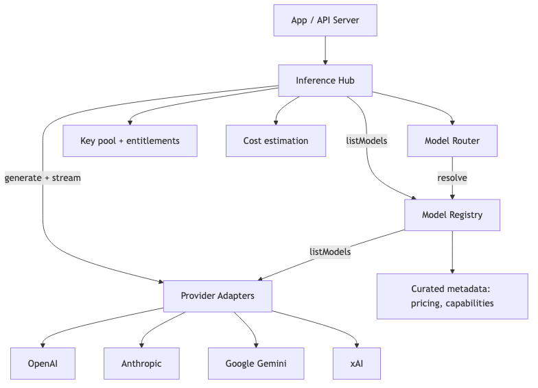

# ai-kit documentation

## Overview
ai-kit is a monorepo that standardizes model discovery, routing, and inference across
Node.js, Go, and Python. Each SDK exposes a Kit for generation, transcription, a model registry with caching,
optional model routing, and SSE support for progressive UI rendering.

Key building blocks:
- Kit: orchestration layer for list, generate, transcribe, and stream.
- Model registry: caches provider model lists, applies scraped metadata and pricing.
- Model router: resolves a preferred or cheapest model based on constraints.
- Provider adapters: OpenAI, Anthropic, Google Gemini, Amazon Bedrock, xAI, and Ollama.
- HTTP handlers (Node/Go) and ASGI adapter (Python): drop-in endpoints for REST + SSE.

## Architecture

The Kit delegates list/generate to adapters, the registry caches and enriches models, and the
router selects a primary model plus fallbacks when you need to auto-resolve across providers.

## Streaming (SSE)

SSE streams expose incremental chunks so UIs can render text as it arrives. Node/Go ship HTTP
handlers and Python ships an ASGI adapter that format `event: chunk` and `event: done` responses.

## Model metadata
Scraped provider metadata lives in `models/<provider>/scraped_models.json` and is generated
by `pnpm refresh:models`. Manual catalogs (ex: `models/replicate_models.json`) define
pipeline-specific model families that are not scraped.

## Evaluation notes
- Consistent core concepts across languages (Kit, registry, router, SSE chunks).
- Pricing is derived from scraped model metadata; if a model is missing pricing metadata,
  cost estimation returns `None`/`undefined`.
- Node focuses on live provider lists plus scraped metadata.
- Python exposes optional local pipelines (Transformers + Torch) for basic vision tasks.

## Related docs
- HTTP API: `docs/http-api.md`
- OpenAPI spec: `servers/openapi.yaml`
- Deterministic testing: `docs/testing.md`
